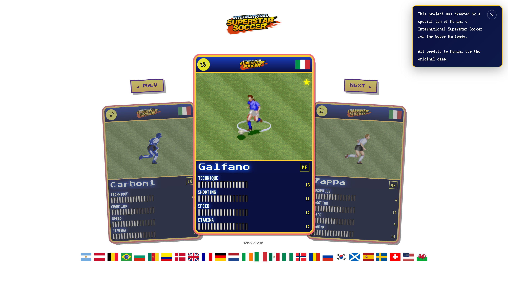

# International SuperTramp Soccer

International SuperTramp Soccer is a super trump game inspired in International SuperStar Soccer from Super Nintendo (Konami).  
The [author](https://github.com/eurafa) is BIG fan of the SNES game, it's and old project finally implemented using AI.  

Nostalgic!  
I had very good times playing this game with family and friends! 🕹️

Take a look, share, have fun! ⚽

[https://international-supertrump-soccer.vercel.app](https://international-supertrump-soccer.vercel.app/)



## Run locally

### Prerequisites

- Node.js 18 or later

### Build

```bash
npm install
npm run build
```

### Run

```bash
npm run dev
```

## Contributing

Feel free to contribute!

We can improve the UI, add player images and more new features! Bring your ideas!

Have fun and raise your PR!

## Donation

<a href="https://www.buymeacoffee.com/eurafa" alt="Buy Me A Coffee">


</a>
<a href="https://www.paypal.com/donate/?business=eu.rafa@gmail.com" alt="Donate via PayPal">

</a>
<a href="https://www.paypal.com/donate/?business=53YNUUWA5R94A&no_recurring=0&currency_code=USD" alt="Donate via PayPal">

</a>
